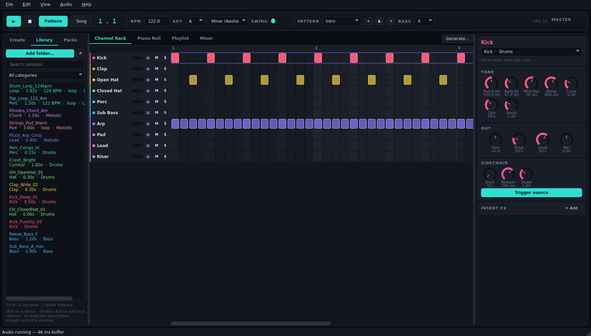
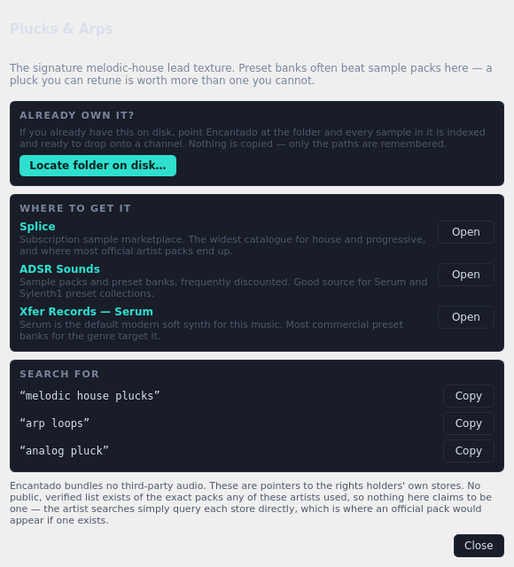
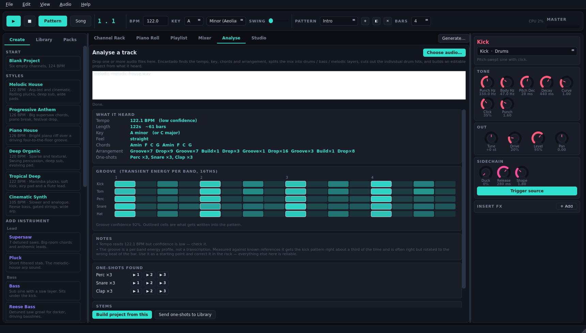
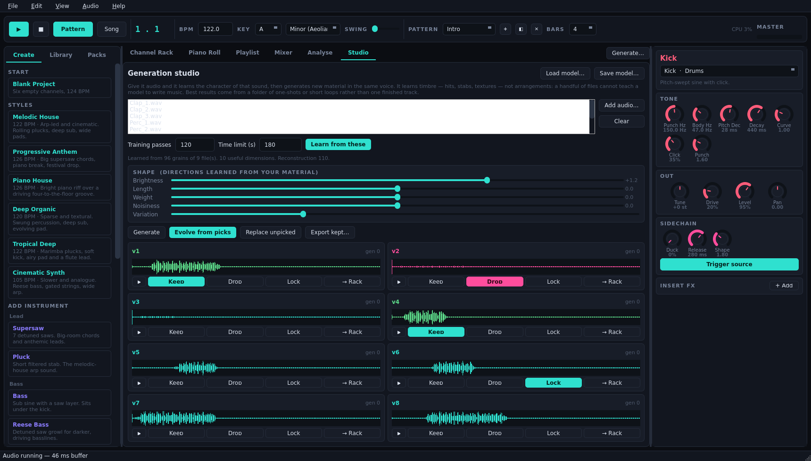

# Encantado

A pattern-based music studio for melodic house, progressive and electronica,
built with PyQt6, numpy and scipy. Step sequencer, piano roll, arrangement
playlist, mixer, and a complete synthesis and effects engine.

Named for the shapeshifter of Amazonian folklore who turns up at the party and
enchants everyone with music.


## What it is

Every sound is synthesised from scratch — there are no bundled samples, so the
project carries no third-party audio licensing and the whole instrument is a few
hundred kilobytes of Python. A Sampler instrument is included for loading your
own WAV files.

Six style templates each build a complete two-minute arrangement you can play
immediately and then take apart: **Melodic House**, **Progressive Anthem**,
**Piano House**, **Deep Organic**, **Tropical Deep** and **Cinematic Synth**.

## Install and run

Requires Python 3.10+ with `PyQt6`, `numpy` and `scipy`. Realtime audio uses
Qt's own `QAudioSink`, so no extra audio library is needed.

```bash
pip install PyQt6 numpy scipy
python -m encantado
```

Or use the launcher, which pins the interpreter that has the dependencies:

```bash
./encantado.sh
```

## The four views

**Channel Rack** — the step sequencer. One row per instrument, one column per
16th note. Click or drag to draw, right-click to erase, ctrl-drag up and down to
set velocity. `▤` opens a channel in the piano roll.

**Piano Roll** — for melodies, chords and basslines. Notes from the other
channels show behind yours as ghosts so you can write against the harmony. Rows
outside the project key are shaded, and holding alt snaps to the key.


**Playlist** — the arrangement. Patterns become clips on a timeline. Click to
place, drag to move, drag the right edge to repeat, right-click to erase.

**Mixer** — volume, pan, reverb and delay sends, and a sidechain amount per
channel, plus the master chain: DJ filter, EQ, glue compressor, reverb, delay
and limiter.


## Using your own samples

Encantado bundles no third-party audio, but it will happily play yours.

**Library tab** — point it at a folder (or drag one onto the window) and it
indexes everything underneath: WAV directly, and AIFF, FLAC, MP3, OGG and M4A
through ffmpeg. Each file is classified from its name and length into kicks,
claps, hats, percussion, bass, leads, chords, pads, vocals, FX and loops, and
any BPM or musical key in the filename is picked up too. Click a sample to
audition it, double-click to drop it onto a Sampler channel with its root note
already set.

Nothing is copied or moved — the index stores paths, so your packs stay exactly
where they are.



**Packs tab** — a directory of the legitimate storefronts this genre buys from,
organised by what you need (melodic house drums, organic percussion, plucks,
pads, vocal chops, risers, Serum and Sylenth1 preset banks) plus a per-artist
search. Click any entry and you get the vendors, ready-made search terms, and a
*Locate folder on disk* button for packs you already own.



One thing stated plainly there and here: **no verified public list exists of the
exact sample packs any of these artists used**, so Encantado does not invent
one. The artist entries search each store directly, which is where an official
pack appears if one exists.

**Drag and drop** — audio files become Sampler channels, folders get indexed,
and a `.ecp` file opens as a project.

## Analysing a track

The **Analyse** tab takes audio you drop on it and tells you what is in it, then
builds an editable project from what it heard.



Validated against this project's own renders, where the answer is known exactly:

| | |
|---|---|
| Tempo | 6/6 exact, within 0.1% |
| Beat grid | predictive tracking, does not drift over a full track |
| Key | scale right 4–5 times in 6; correct tonic in the top two 5/6 |
| Chords | recovers the reference progressions (Am F C G) |
| Sections | intro / groove / build / drop / break from energy and kick presence |
| Stems | drums, bass and melodic layers by harmonic-percussive separation |
| One-shots | sliced at onsets; role classification is 7/7 on isolated hits |

**What it will not do**, stated plainly: transcribe exactly which drum plays on
which step of a finished, mastered mix. The kick's click bleeds into the snare
band and basslines sit in the kick band; separating those needs a trained
separator, which this does not ship. The groove is therefore shown as a
per-band energy heat map with a confidence figure and written into an editable
pattern for you to correct — measured against known references it gets the kick
pattern right about a third of the time, and is often right but rotated to the
wrong beat of the bar. Everything else above is reliable.

## The generation studio

The **Studio** tab learns from audio you give it and generates new material in
the same voice — then lets you refine it by ear over successive rounds.



It trains a small convolutional VAE on spectrogram grains cut from your files.
Be clear about what that means: it learns **timbre** — hits, stabs, textures —
not arrangement. A handful of files cannot teach a model to write music, and
nothing here pretends otherwise. The musical structure comes from the analysis
engine and the sequencer; the model supplies the sound. It works best on a
folder of one-shots or short loops, not on one finished track.

The loop is the point. You never get a single render:

1. **Learn** from your files (a few minutes on a GPU, in its own process so the
   app stays responsive).
2. **Generate** a population of candidates.
3. **Keep** the ones going the right way, **Drop** the ones that are not, and
   **Lock** any you want untouched.
4. **Evolve** — the next generation is bred from what you kept and pushed away
   from what you dropped. Locked ones carry through unchanged.
5. Repeat until it is what you want, then send it **→ Rack** as a Sampler
   channel, or export it as WAV.

The four **Shape** sliders are directions the model actually found in your
material — brightness, length, weight, noisiness — measured in standard
deviations of your own data, and constrained to the part of the latent space
the decoder responds to.

Requires PyTorch with CUDA for reasonable training times. Without PyTorch the
tab is disabled and everything else still works.

## Making it sound like the genre

**Sidechain.** The pumping in modern house is ducking triggered by the kick.
Every channel has a *Duck* knob; any channel marked *Trigger source* fires it.
Set the bass to 80–90%, pads and leads to 40–60%.

**The Generate button** (Ctrl+G) writes chords, arpeggios, basslines, melodies
or drum grooves into the current pattern using the project key and one of ten
progressions — the minor i–VI–III–VII workhorse, the major pop axis, and the
modal changes this music tends to sit on.

**Instruments.** Supersaw for big chords, Pluck for the arps that carry melodic
house, Bass for the sub, Pad and Choir for breakdowns, FM Keys for pianos,
bells and marimbas, Reese for darker basslines, plus eight synthesised drums
and a noise riser.

## Shortcuts

| | |
|---|---|
| Space | Play / pause |
| Esc | All notes off |
| F1 – F4 | Channel Rack, Piano Roll, Playlist, Mixer |
| Ctrl+G | Generate |
| Ctrl+S / Ctrl+O / Ctrl+N | Save, open, new |
| Ctrl+E | Export WAV |
| Ctrl+L | Add a folder of your own samples |
| F5 / F6 | Analyse a track, Generation studio |
| Ctrl+Z | Undo |
| Z S X D C V G B H N J M | Play notes |
| Q 2 W 3 E R 5 T 6 Y 7 U | Octave above |
| `[` `]` | Shift keyboard octave |

## Files

Projects save as `.ecp` (JSON). Renders export to 16-bit WAV through the same
code path used for playback, so the export matches what you heard.

## How it works

- `encantado/dsp/base.py` — PolyBLEP oscillators, supersaw, envelopes
- `encantado/dsp/filters.py` — resonant biquad filters with block-rate modulation
- `encantado/dsp/instruments.py`, `drums.py` — the voices
- `encantado/dsp/effects.py` — reverb, delay, chorus, phaser, drive, dynamics, sidechain
- `encantado/dsp/engine.py` — transport, step scheduler, buses, master chain
- `encantado/analysis/` — tempo, key, chords, separation, song recipe
- `encantado/ai/` — spectral codec, grain VAE, training, interactive evolution
- `encantado/core/` — project model, music theory, sample library, pack sourcing
- `encantado/presets/` — pattern builders and the style templates
- `encantado/ui/` — the Qt interface

The engine renders roughly 8× faster than realtime and uses about 12% CPU on a
full arrangement, so there is headroom for a lot more channels than the
templates use.

## Licence

MIT — see `LICENSE`.
