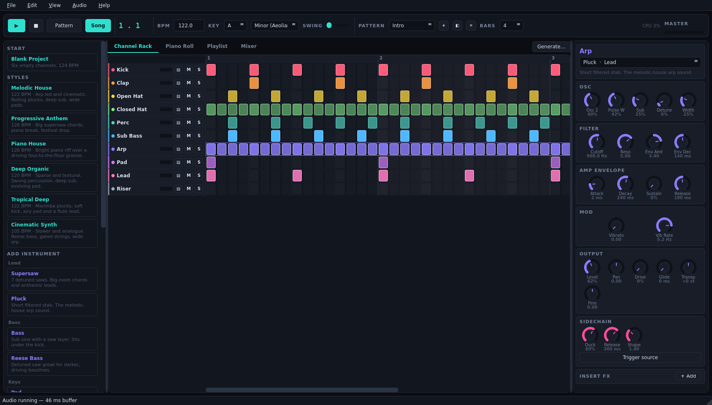
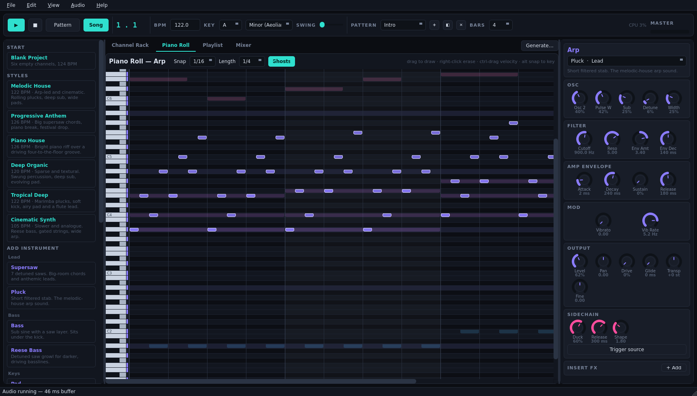
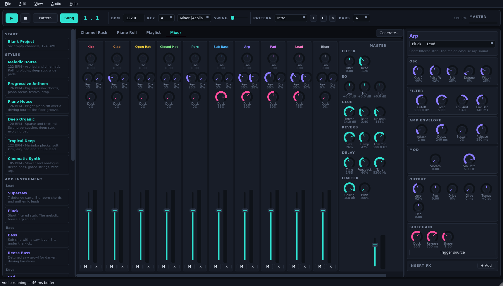

# Encantado

A pattern-based music studio for melodic house, progressive and electronica,
built with PyQt6, numpy and scipy. Step sequencer, piano roll, arrangement
playlist, mixer, and a complete synthesis and effects engine.

Named for the shapeshifter of Amazonian folklore who turns up at the party and
enchants everyone with music.



## What it is

Every sound is synthesised from scratch — there are no bundled samples, so the
project carries no third-party audio licensing and the whole instrument is a few
hundred kilobytes of Python. A Sampler instrument is included for loading your
own WAV files.

Six style templates each build a complete two-minute arrangement you can play
immediately and then take apart: **Melodic House**, **Progressive Anthem**,
**Piano House**, **Deep Organic**, **Tropical Deep** and **Cinematic Synth**.

## Install and run

Requires Python 3.10+ with `PyQt6`, `numpy` and `scipy`. Realtime audio uses
Qt's own `QAudioSink`, so no extra audio library is needed.

```bash
pip install PyQt6 numpy scipy
python -m encantado
```

Or use the launcher, which pins the interpreter that has the dependencies:

```bash
./encantado.sh
```

## The four views

**Channel Rack** — the step sequencer. One row per instrument, one column per
16th note. Click or drag to draw, right-click to erase, ctrl-drag up and down to
set velocity. `▤` opens a channel in the piano roll.

**Piano Roll** — for melodies, chords and basslines. Notes from the other
channels show behind yours as ghosts so you can write against the harmony. Rows
outside the project key are shaded, and holding alt snaps to the key.



**Playlist** — the arrangement. Patterns become clips on a timeline. Click to
place, drag to move, drag the right edge to repeat, right-click to erase.

**Mixer** — volume, pan, reverb and delay sends, and a sidechain amount per
channel, plus the master chain: DJ filter, EQ, glue compressor, reverb, delay
and limiter.



## Making it sound like the genre

**Sidechain.** The pumping in modern house is ducking triggered by the kick.
Every channel has a *Duck* knob; any channel marked *Trigger source* fires it.
Set the bass to 80–90%, pads and leads to 40–60%.

**The Generate button** (Ctrl+G) writes chords, arpeggios, basslines, melodies
or drum grooves into the current pattern using the project key and one of ten
progressions — the minor i–VI–III–VII workhorse, the major pop axis, and the
modal changes this music tends to sit on.

**Instruments.** Supersaw for big chords, Pluck for the arps that carry melodic
house, Bass for the sub, Pad and Choir for breakdowns, FM Keys for pianos,
bells and marimbas, Reese for darker basslines, plus eight synthesised drums
and a noise riser.

## Shortcuts

| | |
|---|---|
| Space | Play / pause |
| Esc | All notes off |
| F1 – F4 | Channel Rack, Piano Roll, Playlist, Mixer |
| Ctrl+G | Generate |
| Ctrl+S / Ctrl+O / Ctrl+N | Save, open, new |
| Ctrl+E | Export WAV |
| Ctrl+Z | Undo |
| Z S X D C V G B H N J M | Play notes |
| Q 2 W 3 E R 5 T 6 Y 7 U | Octave above |
| `[` `]` | Shift keyboard octave |

## Files

Projects save as `.ecp` (JSON). Renders export to 16-bit WAV through the same
code path used for playback, so the export matches what you heard.

## How it works

- `encantado/dsp/base.py` — PolyBLEP oscillators, supersaw, envelopes
- `encantado/dsp/filters.py` — resonant biquad filters with block-rate modulation
- `encantado/dsp/instruments.py`, `drums.py` — the voices
- `encantado/dsp/effects.py` — reverb, delay, chorus, phaser, drive, dynamics, sidechain
- `encantado/dsp/engine.py` — transport, step scheduler, buses, master chain
- `encantado/core/` — project model and music theory
- `encantado/presets/` — pattern builders and the style templates
- `encantado/ui/` — the Qt interface

The engine renders roughly 8× faster than realtime and uses about 12% CPU on a
full arrangement, so there is headroom for a lot more channels than the
templates use.

## Licence

MIT — see `LICENSE`.
